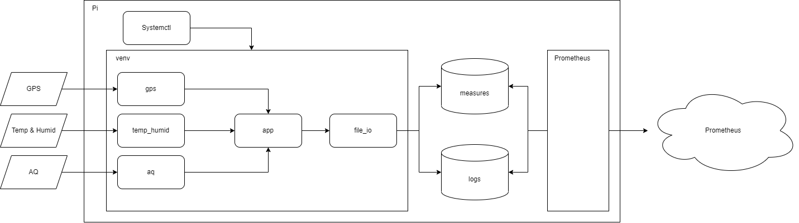

# Thought 1 - Solution

Read from sensors:

 - GPS
 - Temperature & Humiditity
 - Air Quality

Post process the data to a readable format.

Append the recordings to a text file, named based on the current date.

Append any errors or info logs to a seperate log text file, named based on the current date.

# Thought 2 - Architecture

